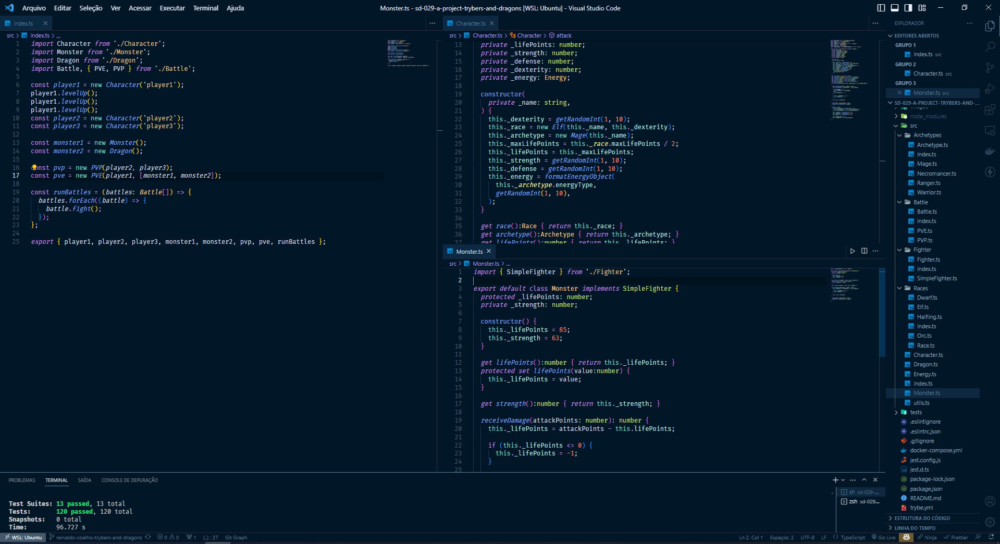
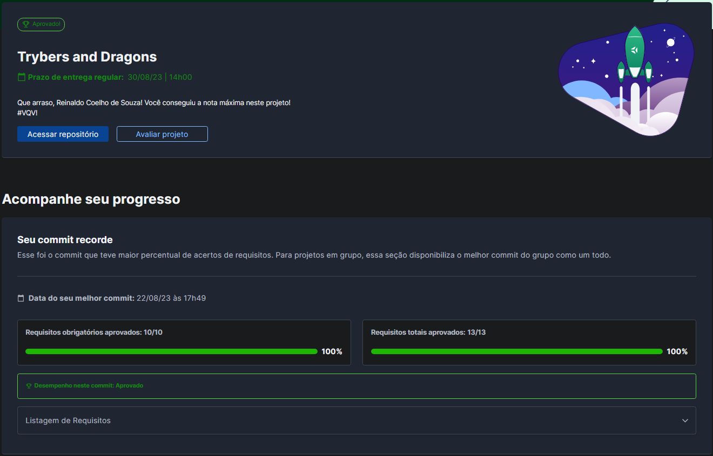

# 🐉 Trybers and Dragons

## 📘 Sobre

Apliquei os princípios da arquitetura SOLID e os conceitos de POO em uma estrutura de jogo de RPG (Role Playing Game).

## ⚛️ Ferramentas

- Programação Orientada a Objetos (POO) e princípios SOLID;
- Node.js;
- TypeScript;
- Docker;

## 🛠️ Como executar o projeto?

1. Suba os containers da aplicação com `docker-compose up -d`.
2. Abra o terminal do container `docker exec -it trybers_and_dragons bash`.
3. Inicie o servidor `npm run dev`.

## 📝 Nota

